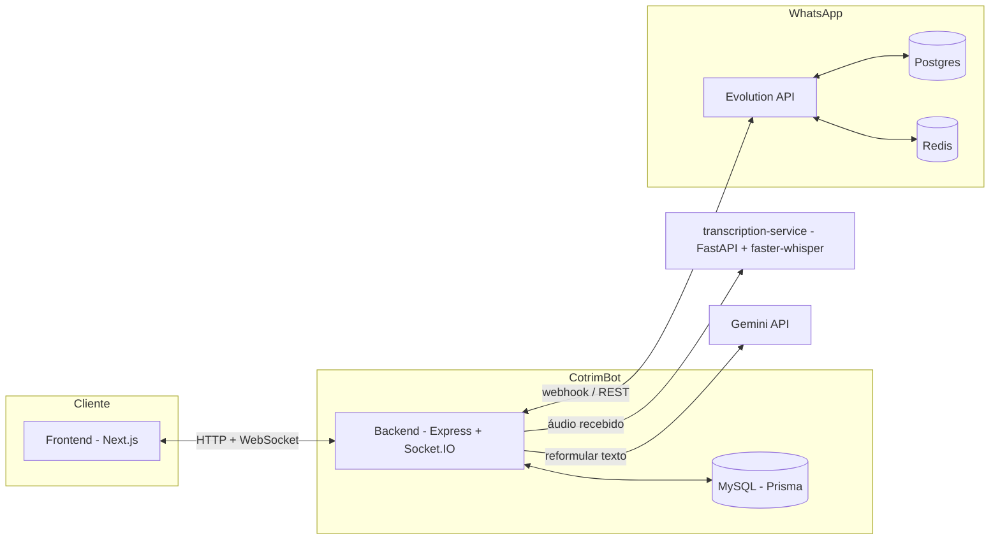

# CotrimBot

Plataforma de atendimento multi-conversa para WhatsApp. Integra com a
[Evolution API](https://github.com/EvolutionAPI/evolution-api) para enviar e
receber mensagens, oferece transcrição automática de áudios e reformulação de
texto por IA, com um chat em tempo real construído em Next.js + Socket.IO.

## Arquitetura



## Estrutura do repositório

```
backend/                 # API Express + Socket.IO + Prisma (MySQL)
frontend/                # Chat web em Next.js
transcription-service/   # Microserviço Python (FastAPI + faster-whisper)
docker-compose.yml        # Orquestra app, MySQL, Postgres, Redis, Evolution API e transcription-service
Dockerfile                 # Build da imagem única do frontend + backend
```

## Principais tecnologias

| Parte | Tecnologias |
| --- | --- |
| Frontend | Next.js 16, React 19, Tailwind CSS 4, Socket.IO Client |
| Backend | Express 5, Socket.IO, Prisma 7, MySQL |
| Transcrição | Python 3.11, FastAPI, faster-whisper, ffmpeg |
| Infraestrutura | Docker Compose, Evolution API, Postgres, Redis |
| IA | Gemini API (reformulação de texto) |

## Funcionalidades

- Chat em tempo real (texto, imagem, figurinha, vídeo, áudio e documento) via Socket.IO.
- Envio e recebimento de mensagens do WhatsApp através da Evolution API.
- Reações a mensagens e avatares de contatos/grupos em cache.
- Arquivamento de contatos e grupos.
- Transcrição automática de áudios recebidos (microserviço Python com faster-whisper).
- Reformulação de texto com IA (Gemini) antes de enviar uma mensagem.
- Encerrar uma conversa devolvendo o atendimento ao bot.

## Pré-requisitos

- Node.js >= 22 e npm
- Docker e Docker Compose (para rodar o ambiente completo)
- Python 3.11 (apenas se for rodar o `transcription-service` fora do Docker)

## Variáveis de ambiente

Crie um arquivo `.env` na raiz do projeto com as variáveis abaixo (os valores
reais — senhas, chaves de API — não devem ser commitados nem compartilhados).

| Variável | Descrição |
| --- | --- |
| `APP_PORT` / `PORT` | Porta do backend (e do app publicado no Docker). |
| `NEXT_PUBLIC_API_URL` | URL pública da API usada pelo frontend. |
| `DATABASE_URL` | Connection string do MySQL usada pelo Prisma. |
| `DATABASE_HOST` | Host do MySQL. |
| `DATABASE_PORT` | Porta do MySQL. |
| `DATABASE_USER` | Usuário do MySQL. |
| `DATABASE_PASSWORD` | Senha do MySQL. |
| `DATABASE_NAME` | Nome do banco MySQL. |
| `EVOLUTION_API_URL` | URL base da Evolution API. |
| `EVOLUTION_API_KEY` | Chave de autenticação da Evolution API. |
| `EVOLUTION_INSTANCE` | Nome da instância do WhatsApp na Evolution API. |
| `GEMINI_API_KEY` | Chave da API do Gemini usada para reformular texto. |
| `TRANSCRIPTION_SERVICE_URL` | URL do microserviço de transcrição. |

Variáveis adicionais usadas apenas pelo `docker-compose.yml` (bancos internos
da Evolution API e portas expostas):

| Variável | Descrição |
| --- | --- |
| `MYSQL_ROOT_PASSWORD` | Senha root do container MySQL. |
| `POSTGRES_USER` / `POSTGRES_PASSWORD` / `POSTGRES_DB` | Credenciais do Postgres interno da Evolution API. |
| `POSTGRES_PORT` | Porta publicada do Postgres. |
| `REDIS_PORT` | Porta publicada do Redis. |
| `EVOLUTION_PORT` | Porta publicada da Evolution API. |

## Rodando em desenvolvimento (sem Docker)

```powershell
npm install
npm run prisma:generate
npm run dev
```

`npm run dev` usa o Turborepo para subir o frontend (`http://localhost:3000`) e
o backend (`http://localhost:3333`) juntos. O MySQL e a Evolution API precisam
estar acessíveis (localmente ou via Docker) e configurados no `.env`.

O `transcription-service` roda à parte:

```powershell
cd transcription-service
pip install -r requirements.txt
uvicorn main:app --reload --port 5000
```

## Rodando com Docker Compose (ambiente completo)

```powershell
docker compose up --build
```

Sobe todos os serviços: `cotrimbot` (frontend + backend), `mysql`, `postgres`
e `redis` (usados pela Evolution API), `evolution-api` e `transcription`. As
URLs internas entre os serviços já são configuradas pelo próprio
`docker-compose.yml` (por exemplo, `EVOLUTION_API_URL` e
`TRANSCRIPTION_SERVICE_URL` apontam para os nomes dos containers).

## Banco de dados

O schema fica em [backend/prisma/schema.prisma](backend/prisma/schema.prisma),
com os modelos `Contact` e `Message`. Para aplicar migrações em desenvolvimento:

```powershell
npm run prisma:migrate
```

## Rotas da API

Todas as rotas abaixo são servidas pelo backend sob o prefixo `/api`.

| Método | Rota | Descrição |
| --- | --- | --- |
| GET | `/contacts` | Lista contatos. |
| GET | `/contacts/:id` | Busca um contato. |
| GET | `/contacts/:id/avatar` | Avatar em cache do contato. |
| POST | `/contacts` | Cria um contato. |
| PATCH | `/contacts/:id` | Atualiza um contato. |
| PATCH | `/contacts/:id/archived` | Arquiva/desarquiva um contato. |
| DELETE | `/contacts/:id` | Remove um contato. |
| GET | `/contacts/:id/messages` | Lista mensagens de um contato. |
| POST | `/contacts/:id/send` | Envia uma mensagem de texto. |
| POST | `/contacts/:id/send-media` | Envia um arquivo de mídia. |
| POST | `/contacts/:id/close-with-bot` | Encerra a conversa devolvendo ao bot. |
| PATCH | `/contacts/:id/messages/read` | Marca mensagens como lidas. |
| GET | `/messages/:id/media` | Baixa a mídia de uma mensagem. |
| GET | `/messages/:id/sender-avatar` | Avatar de quem enviou em um grupo. |
| PUT | `/messages/:id/reaction` | Reage a uma mensagem. |
| POST | `/messages/:id/transcribe` | Transcreve o áudio de uma mensagem. |
| GET | `/transcription/settings` | Consulta as configurações do Whisper. |
| PUT | `/transcription/settings` | Atualiza as configurações do Whisper. |
| POST | `/ai/rewrite` | Reformula um texto com o Gemini. |
| POST | `/webhook/whatsapp` | Webhook de eventos da Evolution API. |

O Socket.IO roda na mesma porta do backend, com CORS liberado para o frontend.

## Documentação por pacote

- [backend/README.md](backend/README.md) — estrutura e comandos do backend.
- [frontend/AGENTS.md](frontend/AGENTS.md) e [frontend/CLAUDE.md](frontend/CLAUDE.md) — convenções do frontend.
